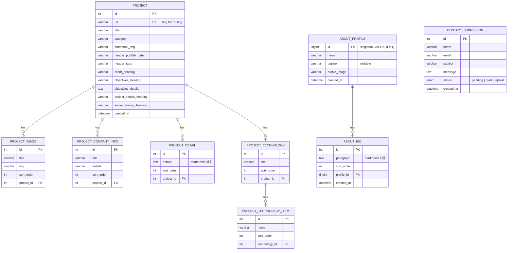

# Database ERD — Portfolio Project

포트폴리오 백엔드(NestJS + MySQL) 현재 DB 스키마. migration 기반으로 관리되며,
엔티티 실제 구현(`apps/api/src/modules/**/*.entity.ts`)을 기준으로 한다.

---

## ER Diagram

---

## 테이블 설명

| 테이블 | 역할 |
|---|---|
| **PROJECT** | 포트폴리오 프로젝트 핵심 정보. `url` 은 프론트의 `/projects/[url]` 라우팅 slug. 각종 heading 은 상세 페이지에서 섹션 제목으로 그대로 렌더됨. |
| **PROJECT_IMAGE** | 프로젝트별 갤러리 이미지. `sort_order` 기준으로 표시 순서 결정. |
| **PROJECT_COMPANY_INFO** | 프로젝트 메타 key-value 쌍 (예: Name / Services / Website / Repository). 값이 URL 형식이면 프론트에서 자동으로 링크 렌더. |
| **PROJECT_DETAIL** | 프로젝트 상세 페이지의 "Challenge" 섹션 본문. 행마다 하나의 마크다운 블록을 저장하고 프론트에서 ReactMarkdown 으로 렌더. |
| **PROJECT_TECHNOLOGY** | 프로젝트 기술 스택의 그룹 (예: "Tools & Technologies"). `PROJECT_TECHNOLOGY_ITEM` 과 1:N. |
| **PROJECT_TECHNOLOGY_ITEM** | 그룹에 속한 개별 기술 이름 (예: "Node.js", "NestJS"). |
| **ABOUT_PROFILE** | `/about` 페이지의 프로필 헤더. **singleton** — `CHECK (id = 1)` 로 DB 레벨에서 두 번째 row 삽입을 거부. |
| **ABOUT_BIO** | 자기소개 단락들. 프로필과 1:N. `paragraph` 는 TEXT 로 마크다운 허용. `sort_order` 로 화면상 순서 결정. |
| **CONTACT_SUBMISSION** | 연락 폼 제출 내역. `status` enum 으로 읽음/답변 상태 추적. |

## 핵심 관계

- **PROJECT → PROJECT_IMAGE / PROJECT_COMPANY_INFO / PROJECT_DETAIL / PROJECT_TECHNOLOGY**: 1:N, ON DELETE CASCADE
- **PROJECT_TECHNOLOGY → PROJECT_TECHNOLOGY_ITEM**: 1:N, ON DELETE CASCADE
- **ABOUT_PROFILE → ABOUT_BIO**: 1:N, ON DELETE CASCADE (ABOUT_PROFILE 은 항상 id=1)
- **CONTACT_SUBMISSION**: 독립 테이블, `POST /api/contact` 에서 INSERT

## 스키마 이력 관리

- 스키마 변경은 모두 `apps/api/src/database/migrations/` 에 typeorm migration 파일로 커밋한다. 상세 절차는 [migrations.md](./migrations.md) 참고.
- 현재 적용된 마이그레이션
  1. `InitialSchema1776680123017` — Project 및 Contact 관련 전 테이블의 baseline
  2. `AddAboutTables1776686773344` — ABOUT_PROFILE / ABOUT_BIO 신설

## 향후 확장 참고

- Priority 2 에서 `USER`(어드민 인증), `COMMENT`, `NEWSLETTER_SUBSCRIBER` 등이 추가될 가능성 있음.
- 현재는 모든 데이터가 시드 스크립트 기반 정적 입력이며, 관리자 화면은 없음.
