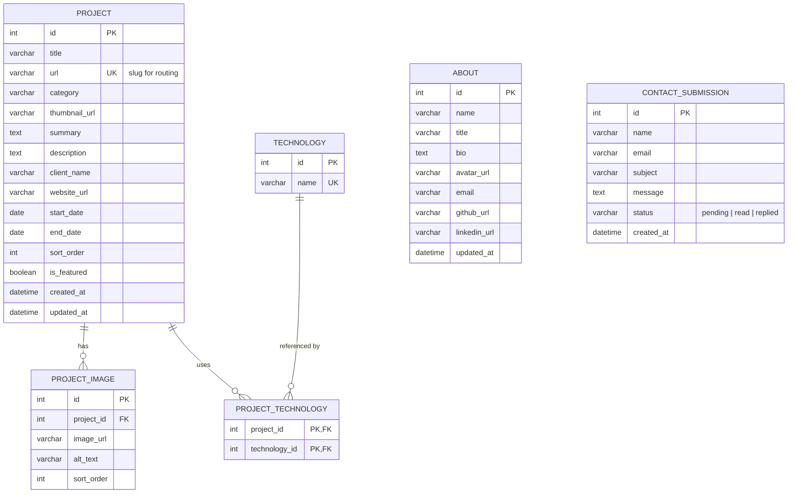

# Database ERD — Portfolio Project

포트폴리오 백엔드(NestJS + MySQL)의 초기 데이터베이스 스키마 제안.
`api-plan.md`의 Priority 1 API(프로젝트 목록/상세, About, Contact)를 지원하는 최소한의 실용적 구조.

---

## ER Diagram

---

## 테이블 설명

| 테이블 | 역할 |
|---|---|
| **PROJECT** | 포트폴리오 프로젝트 핵심 정보. `url`은 프론트의 `[id].jsx` 라우팅에 사용되는 slug. `is_featured`로 메인 페이지 노출 여부 제어. |
| **PROJECT_IMAGE** | 프로젝트별 이미지 갤러리. `sort_order`로 표시 순서 지정. |
| **TECHNOLOGY** | 기술 스택 마스터 테이블 (React, NestJS 등). 프로젝트 간 공유되므로 별도 정규화. |
| **PROJECT_TECHNOLOGY** | 프로젝트 ↔ 기술 다대다(N:M) 관계 조인 테이블. |
| **ABOUT** | 프로필/소개 정보. 단일 레코드로 관리. `GET /api/about` 응답 소스. |
| **CONTACT_SUBMISSION** | 연락 폼 제출 내역 저장. `status` 컬럼으로 읽음/답변 여부 추적. |

## 핵심 관계

- **PROJECT → PROJECT_IMAGE**: 1:N — 프로젝트 하나에 여러 이미지
- **PROJECT ↔ TECHNOLOGY**: N:M — `PROJECT_TECHNOLOGY` 조인 테이블을 통해 연결
- **ABOUT**: 독립 테이블, 단일 레코드
- **CONTACT_SUBMISSION**: 독립 테이블, `POST /api/contact`에서 INSERT

## 향후 확장 참고

Priority 2 단계에서 `USER`(어드민 인증), `COMMENT`, `NEWSLETTER_SUBSCRIBER` 등이 추가될 수 있으나, 이 초기 스키마에서는 제외.
